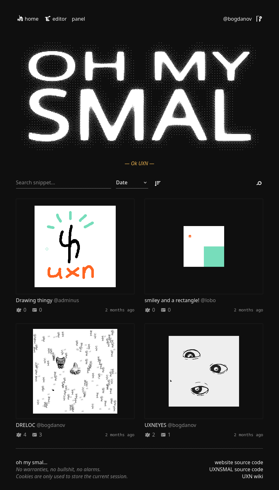
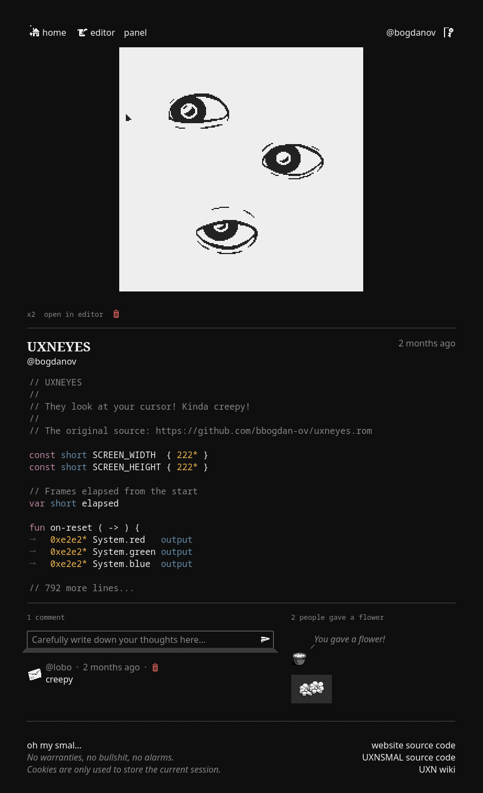
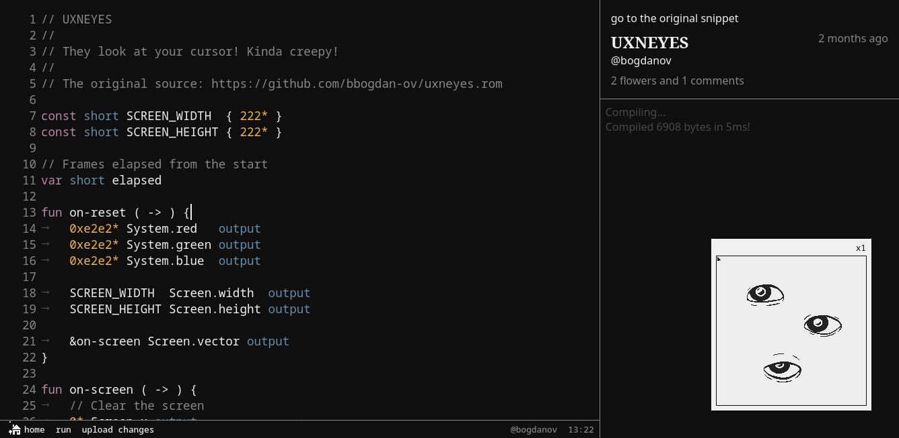
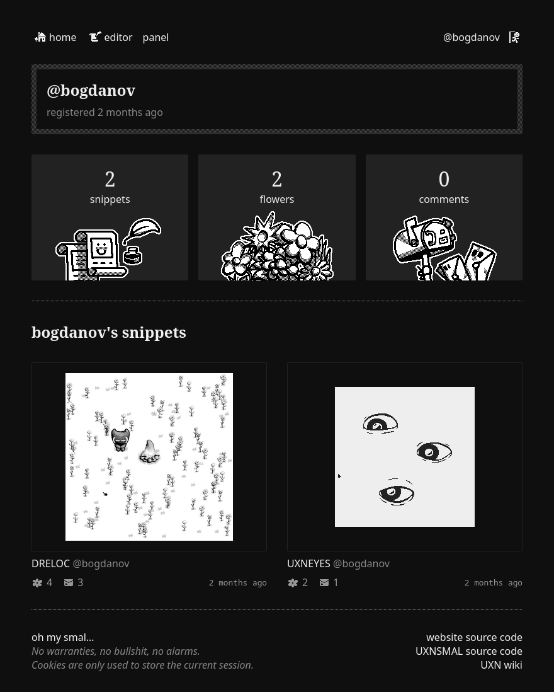

# ohmysmal

Website i made as my college project.

Write, run and post programs, games, visualizations and other fun stuff in my
programming language [UXNSMAL] that runs on the [UXN] virtual machine.

The compiler of [UNXSMAL] and the [UXN] VM run on the website using [WASM].

Visit [ohmysmal.fun], it should be available.

[UXNSMAL]: https://github.com/bbogdan-ov/uxnsmal
[UXN]: https://100r.co/site/uxn.html
[ohmysmal.fun]: https://ohmysmal.fun
[WASM]: https://webassembly.org

## Screenshots

*Home page*

*Snippet page*

*Editor page*

*User page*

## License

MIT license. \
Do whatever you want.
